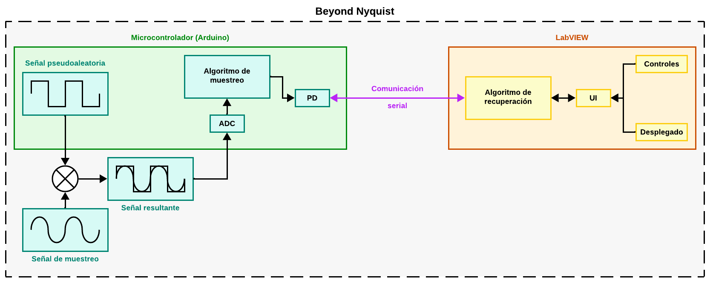

# Beyond Nyquist :microscope:


El siguiente sistema tiene como objetivo el poder demostrar la aduisción, transmisión y reconstrucción de señales comprimidas utilizando:

- [Demodulación aleatoria (paper "Beyond Nyquist")](Docs/).
- [Mínimos cuadrados reponderados iterativamente (IRLS)](Docs/IRLS.md).
- [Protocolo de comunicación serial (Modbus)](Docs/).
- [Visualización y control desde LabVIEW](Docs/VC_LabVIEW.md).

---

## Diagrama general del sistema :building_construction:



---

## Organización de carpetas :file_folder:

```plaintext
02 - Beyond Nyquist/
├── App/
├── Codigos/
|   ├── Prueba/
|   └── Finales/
├── Diagramas/
├── Docs/
|   ├── Papers/
|   ├── IRLS.md/
|   └── VC_LabVIEW.md/
└── Inicio.md/
```

- [Aplicación de LabVIEW](App/).
- [Códigos implementados](Codigos/).
- [Diagrmas](Diagramas/).
- [Documentos (papers y teoria)](Docs/).

---

## :shipit: Copiar proyecto

```sh
git clone https://github.com/Jelp200/Instrumentacion_3.git
```
